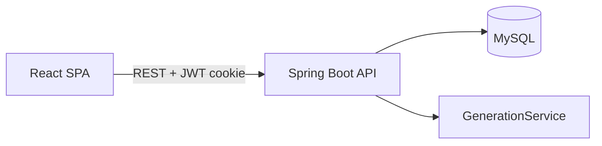

# Architecture

## System context

## Backend layering

Each domain package owns its vertical slice:

- **Web**: `*Controller` — REST endpoints under `/api/...`
- **Service**: business rules and orchestration
- **Persistence**: `*Entity`, `*Repository` (Spring Data JPA)
- **DTOs**: `*RequestModel`, `*ResponseModel`

Cross-cutting code lives outside domains:

- `config` — security filter chain
- `auth` — users and JWT
- `common.exception` — consistent error responses
- `scheduling` — constraint-based timetable generation (backtracking)

## Timetable generation

`TimetableController` delegates auto-generate requests to `scheduling.GenerationService`, which:

1. Builds session tasks from batch subjects (lectures, tutorials, practicals)
2. Searches assignments (teacher, room, consecutive slots) with pruning and retries
3. Persists `TimetableEntity` rows

Manual edits use `timetable.TimetableService`.

## Frontend

Feature-first structure: each route maps to a `features/<name>/` module. HTTP calls go through `features/<name>/api/*Api.ts` using `shared/api/client.ts` (axios, credentials for cookies).

Auth state: `features/auth/authContext.ts` + `app/ProtectedRoutes.tsx`.

## Scheduling package layout

| File | Role |
|------|------|
| `GenerationService.java` | Orchestration, backtracking search, persistence |
| `SchedulingConstants.java` | Weights, limits, day order |
| `SchedulingModels.java` | Records (`SlotGroup`, `AssignmentOption`, …) |
| `SchedulingState.java` | Mutable search state (bitsets, loads) |
| `SessionTask.java` | One schedulable session unit |
| `SearchBudget.java` | Visit counter per attempt |

## Frontend feature map

- `app/routes.tsx` — route table
- `features/departments` — departments only; links to teachers/batches with `?departmentId=`
- `features/teachers`, `features/batches` — dedicated CRUD pages
- `shared/components/PageContainer`, `AppBackground` — consistent layout

## Future improvements

- Further split `GenerationService` (solver vs validator vs persistence)
- Flyway migrations instead of `ddl-auto=update`
- Trim unused shadcn `ui/` components
